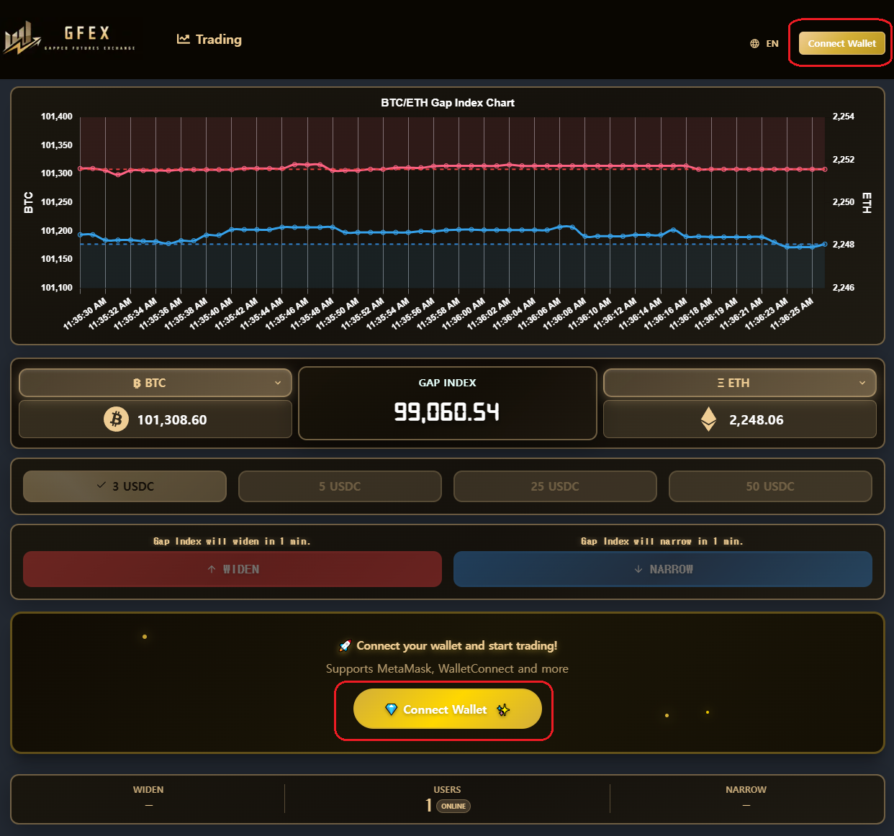
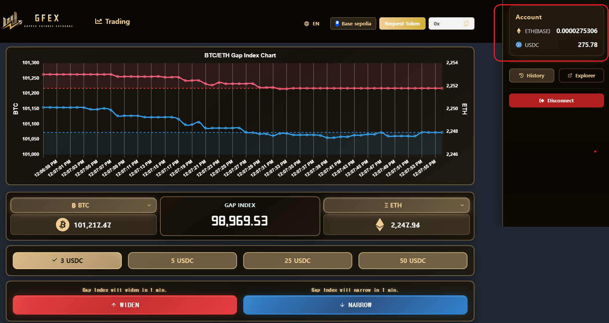
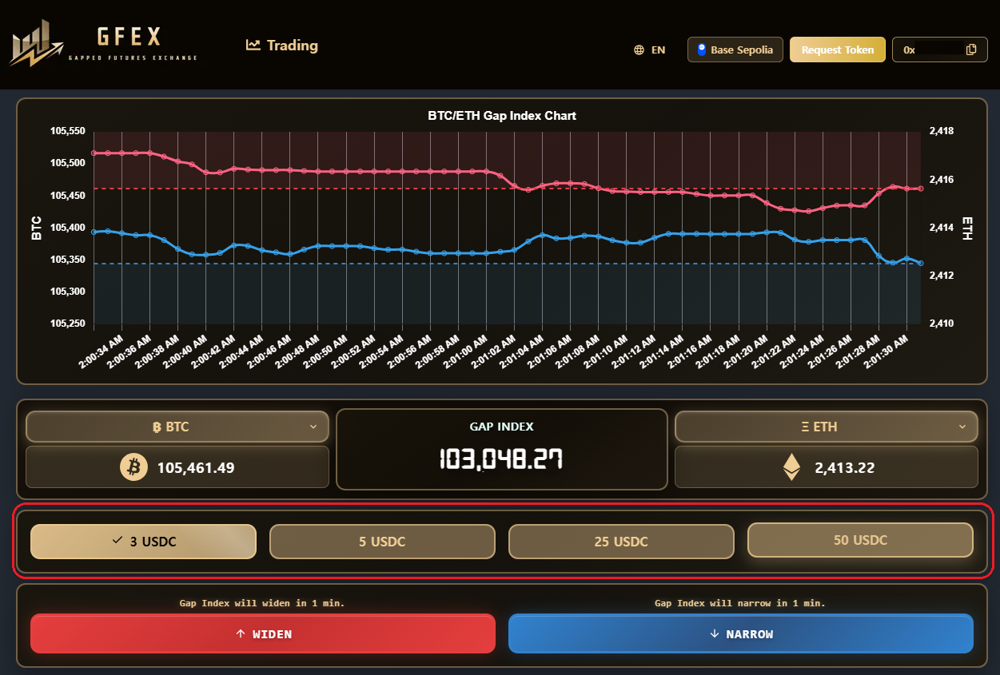
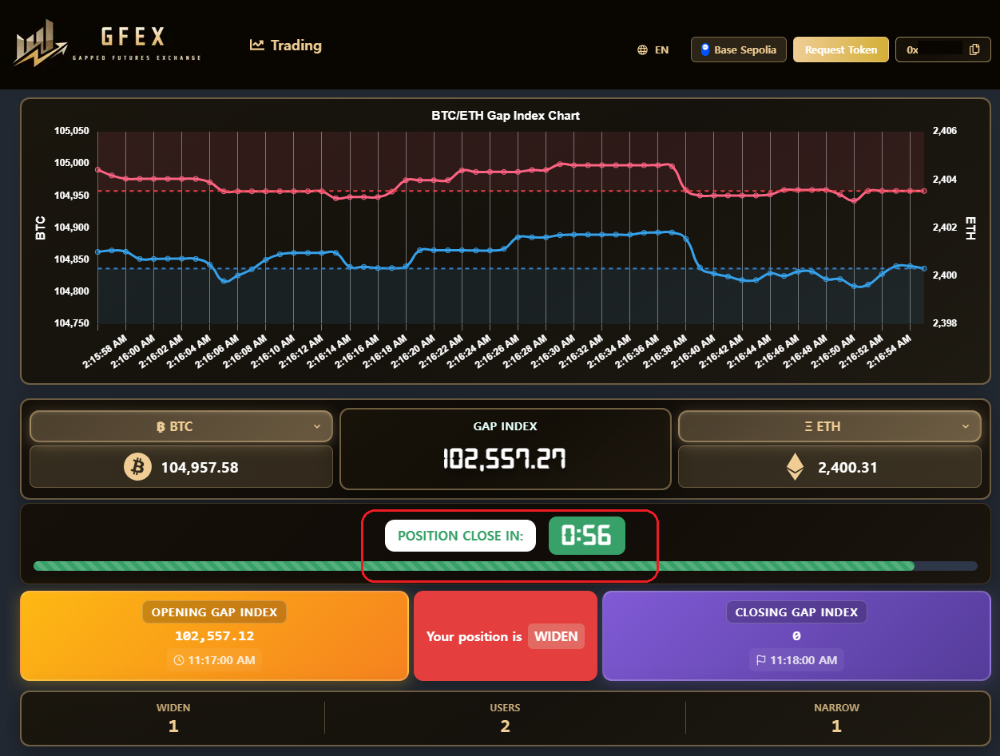

# GFEX Tutorial (PC, Desktop)

### 0. Check the [Video Tutorial](https://youtu.be/6xbVSkk6slY)



### **1. Connect Your Wallet**

Start by connecting your wallet. Click the "Connect Wallet" button located at the top-right corner or at the bottom of the page.

<figure><figcaption>
Click 'Connect Wallet' button to connect your wallet.
</figcaption></figure>

<figure><figcaption>
Click 'Connect' to start the connection approval process.
</figcaption></figure>

### 2. Authorize the Connection

After initiating the wallet connection, you'll need to sign and approve to connect your wallet to GFEX for investment. This authorization step is required only once. After this, you won't need to sign again for connection authorization unless you sign out.

<figure><figcaption>
Click 'Sign message'.
</figcaption></figure>

<figure><figcaption>
Click 'Confirm' to connect your wallet to GFEX.
</figcaption></figure>

<figure><figcaption>
Once connected, you can choose investment options and check the balance of your wallet.
</figcaption></figure>

### 3. Select Investment Options and Signing for the Investment.

Select your desired investment amount ($3, $5, $25, or $50), and your market prediction (<mark style="color:red;">Widen</mark> or <mark style="color:blue;">Narrow</mark>). After confirming these details, a signature request will appear in your wallet to finalize your investment. Your investment will then be executed with a duration of one minute.

<figure><figcaption>
Choose the investment amount.
</figcaption></figure>

<figure><figcaption>
Another signing session for the investment confirmation.
</figcaption></figure>

### 4. Await the Results

After your investment is confirmed, wait for the results based on the duration you selected.

<figure><figcaption>
Once you've made an investment, wait for 1 minute to see the result.
</figcaption></figure>

### 5. Getting Result

Once the selected duration ends, the results will be displayed. Any applicable [fees](../investment/how-proceeds-are-calculated.md#id-3.-example-fee-application-and-profit-distribution) will be deducted, and profits will be processed accordingly.

<figure><figcaption>
The results will be displayed, and after deducting the fees, the profit will be distributed.
</figcaption></figure>
