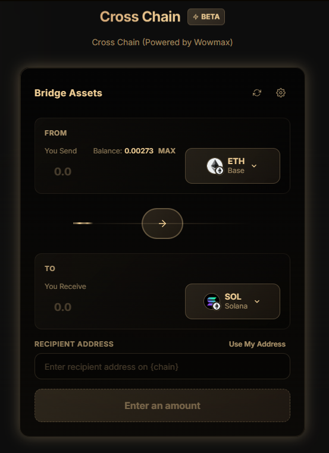

---
metaLinks:
  alternates:
    - https://app.gitbook.com/s/Df3l3S9PwVJaNDJOXgvg/how-to/allowance-setting
---

# 额度设置（Allowance Setting）



### **1. 什么是代币授权？**

代币授权是一项安全功能，允许智能合约代表你花费代币。在合约能够转移你的代币之前，你必须先进行授权。

***

### **2. 为什么需要授权？**

这个两步流程（授权 + 转移）可以保护你的代币免受未授权操作的影响。只有你明确授权的合约才能移动你的代币。

***

### **3. 节省 Gas 费用**

授权更大的金额可以减少交易手续费。\
不必每次交易都支付 Gas 费，只需一次授权即可进行多次交易。\
例如，授权 **$5,000**，即可多次投资，而无需额外支付授权费用。

***

⚠️ **安全提示**\
无限授权虽然方便，但风险更高。仅对可信的合约进行无限授权。你可以随时撤销或减少授权额度。

***

**访问额度设置页面的方法**

#### 1. 点击你的钱包地址按钮，进入 **“我的页面 (My Page)”**。

<figure><figcaption></figcaption></figure>

#### 2. 导航至 **“余额 (Balance)”** 标签页。

<figure><figcaption></figcaption></figure>

#### 3. 向下滚动至 额度设置（Allowance Setting） 区域。

<figure><figcaption></figcaption></figure>

#### 4. 将授权额度设置为你希望的金额，以跳过每次单独授权的步骤。.
