# GFEX 教程（移动端）

## **提示（重要！）**

为了确保在 GFEX 上的安全性和最佳性能，我们建议在 **移动设备上使用** [**MetaMask** ](https://metamask.io)**应用**。\
GFEX 设计为在 [**MetaMask** ](https://www.metamask.io/download)**安全浏览器** 内运行。

### **1. 连接你的钱包**

* 首先连接你的钱包。你可以在 **左上角菜单** 找到 **“Connect Wallet（连接钱包）”** 按钮。

<figure>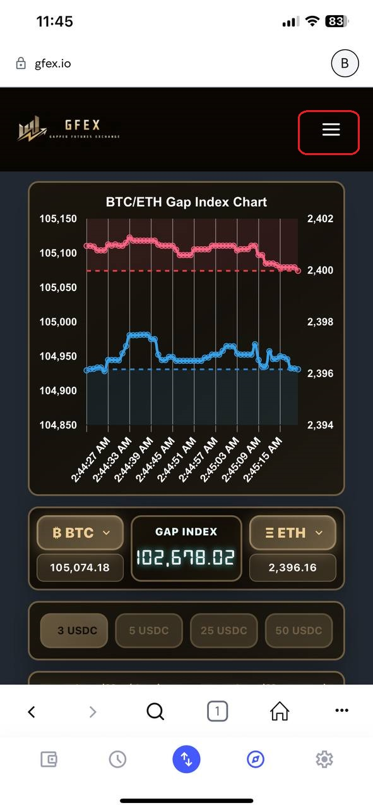<figcaption>
点击左上角菜单。
</figcaption></figure>

<figure>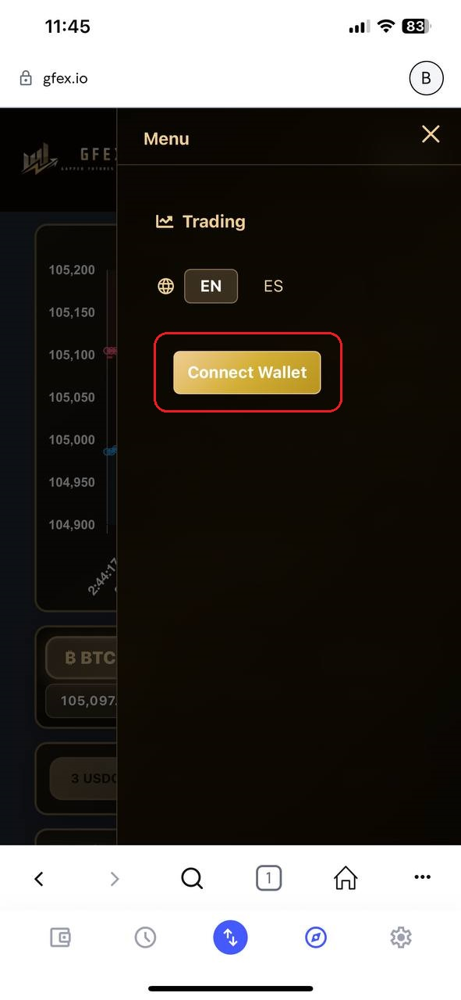<figcaption>
点击 <strong>“Connect Wallet”</strong> 按钮以连接钱包。
</figcaption></figure>

### **2. 授权连接**

* 启动钱包连接后，你需要 **签名并授权**，将钱包连接至 GFEX 以进行投资。
* 该授权步骤只需执行一次，除非你退出登录，否则之后不再需要签名。

<figure>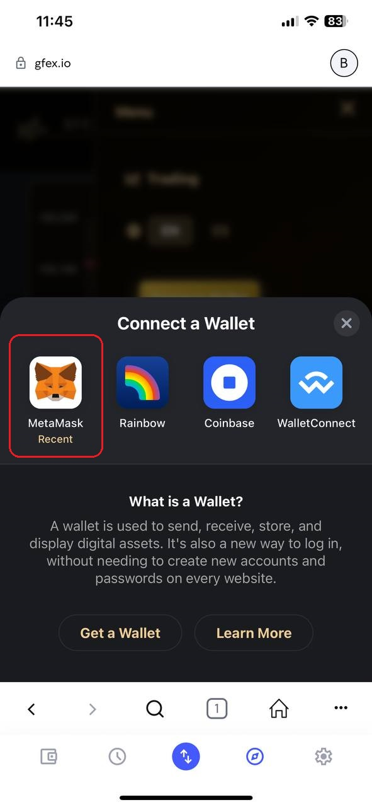<figcaption>
选择 <strong>MetaMask（强烈推荐）</strong>。
</figcaption></figure>

<figure>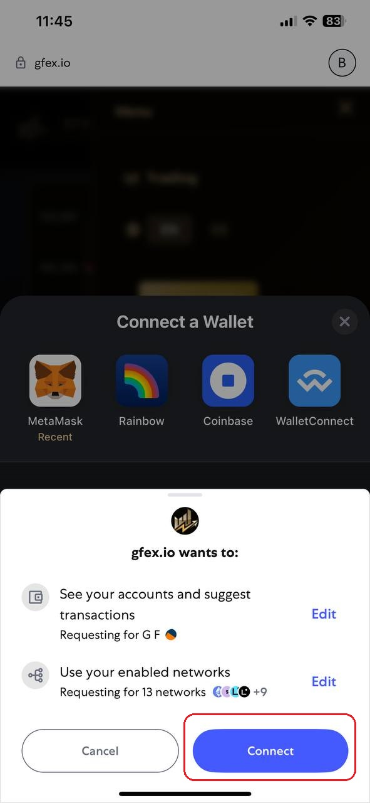<figcaption>
点击 <strong>“Connect（连接）”</strong> 以授权。
</figcaption></figure>

<figure>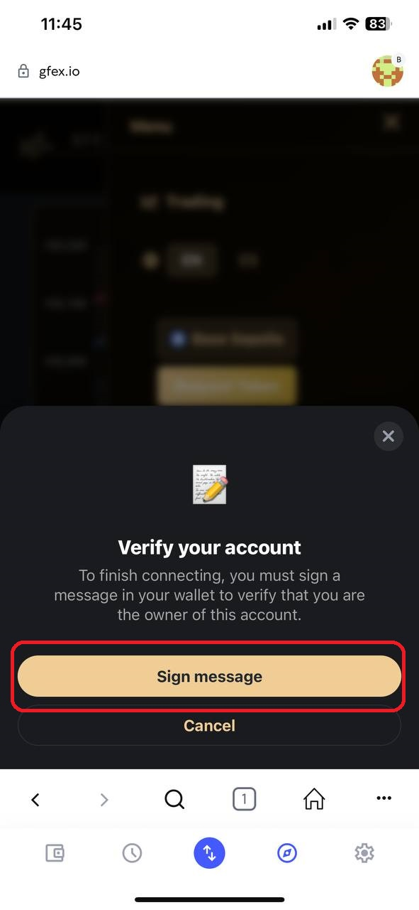<figcaption>
点击 <strong>“Sign message（签署消息）”</strong> 完成授权。
</figcaption></figure>

<figure>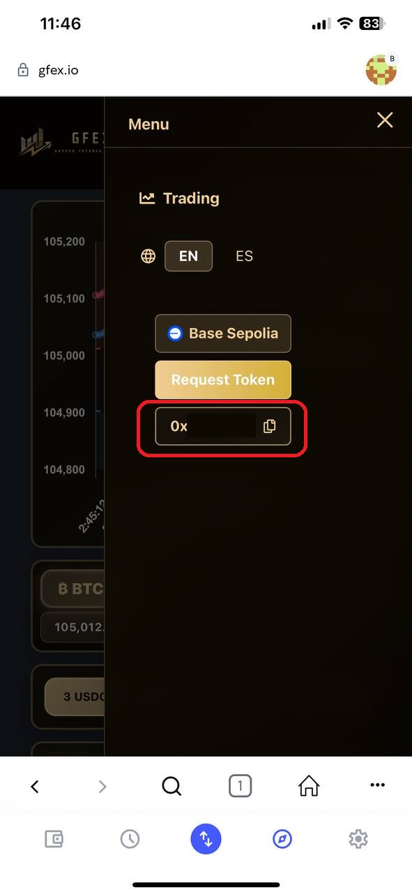<figcaption>
连接成功后，你将看到你的钱包地址。
</figcaption></figure>

<figure>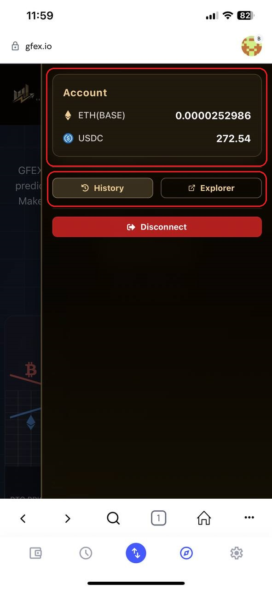<figcaption>
点击地址后，可以查看你的余额、交易历史以及区块浏览器链接。
</figcaption></figure>

### **3. 选择投资选项并签署投资**

* 选择你想投资的金额（$3、$5、$25 或 $50）以及市场预测（<mark style="color:red;">Widen</mark> 或 <mark style="color:blue;">Narrow</mark>）。
* 确认信息后，钱包会弹出签名请求以完成投资。
* 投资将执行 **一分钟的交易周期**。

<figure>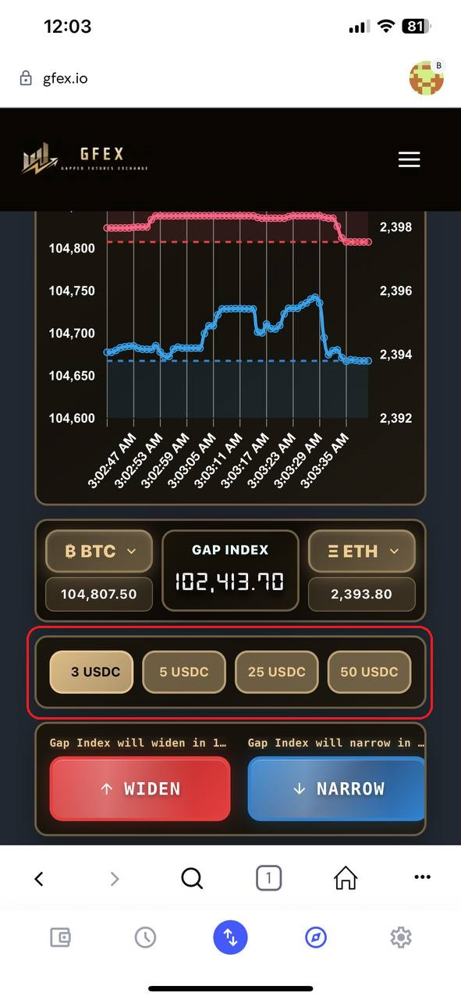<figcaption>
选择投资金额。
</figcaption></figure>

<figure>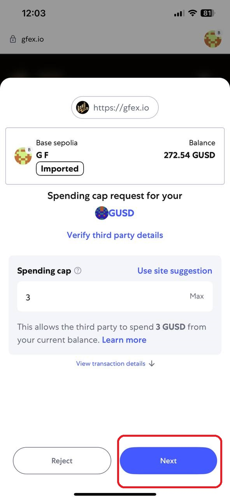<figcaption>
钱包将弹出签名请求以确认投资。
</figcaption></figure>

<figure>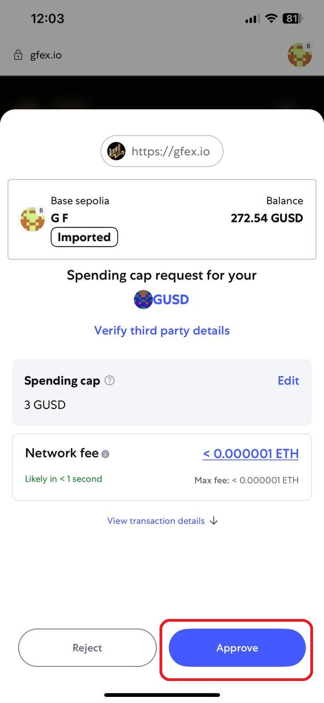<figcaption>
签署支出上限批准（Spending Cap Approval）。
</figcaption></figure>

<figure>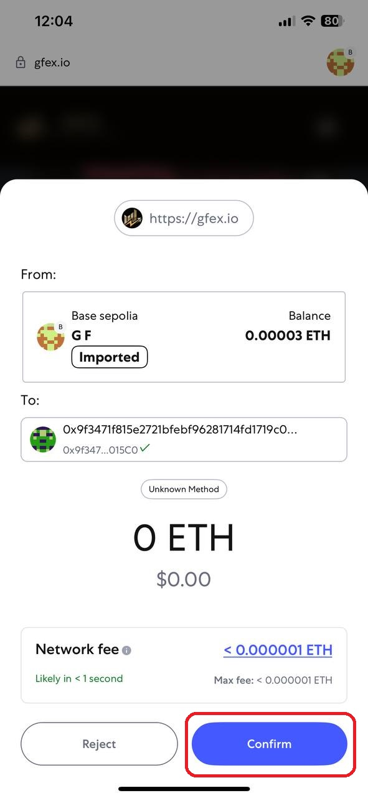<figcaption>
签署 Gas 费用批准（Gas Spending Approval）
</figcaption></figure>

### **4. 等待结果**

选定周期结束后，结果将会显示。系统会扣除相关费用，并按规定处理收益。

<figure>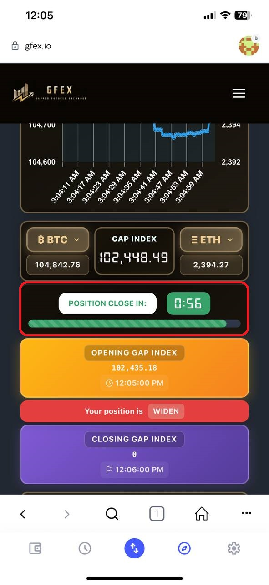<figcaption>
投资确认后，请等待 <strong>1 分钟</strong> 查看结果。
</figcaption></figure>

### **5. 查看结果**

选定周期结束后，结果将会显示。系统会扣除相关费用，并按规定处理收益。

<figure>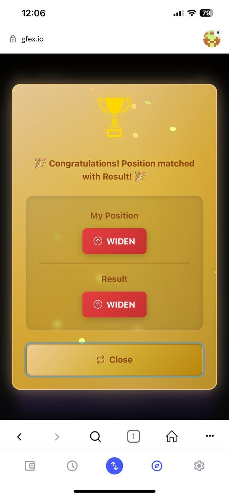<figcaption>
结果将在 1 分钟后显示。
</figcaption></figure>

<figure>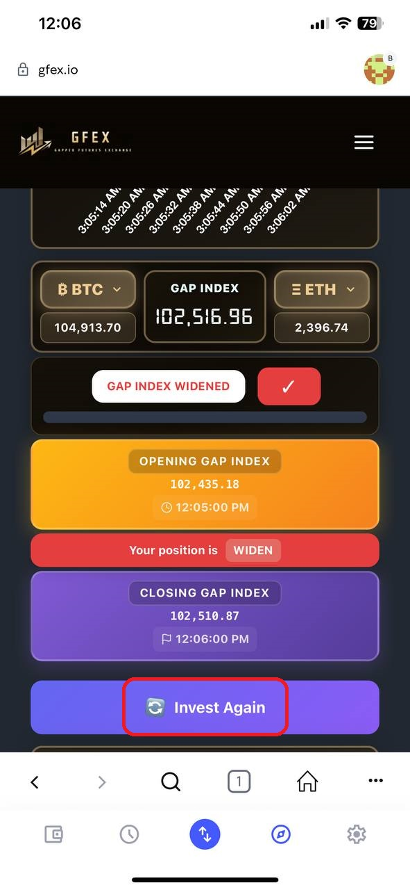<figcaption>
然后点击 <strong>“Invest Again（再次投资）”</strong> 开始下一轮。
</figcaption></figure>
